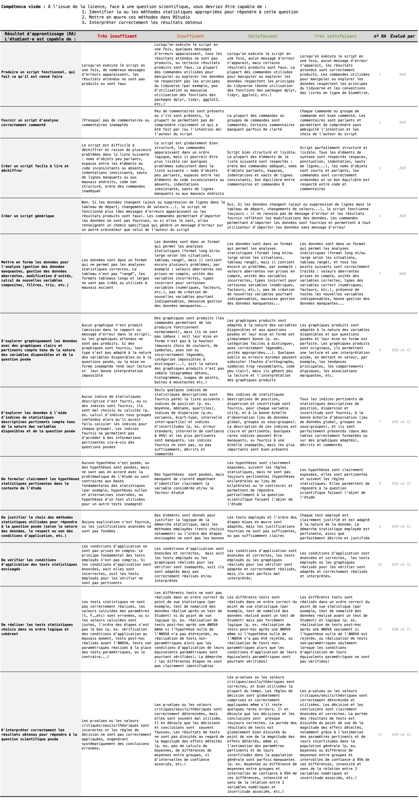

# Introduction {-}


```{r setup, include=FALSE, cache=FALSE, results=FALSE, message=FALSE}
options(replace.assign = TRUE, width = 80)
options(repos = "http://cran.r-project.org/")

list.of.packages <- c(
  "readxl",
  "nycflights13",
  "gapminder",
  "knitr",
  "tidyverse",
  "gridExtra",
  "devtools",
  "extrafont",
  "kableExtra",
  "skimr",
  "bindrcpp",
  "car",
  "DescTools",
  "bookdown",
  "datasauRus",
  "patchwork",
  "fontawesome",
  "palmerpenguins",
  "ggmosaic",
  "confintr",
  "mixdist",
  "scales",
  "marked",
  "popbio"
)
new.packages <- list.of.packages[
  !(list.of.packages %in% installed.packages()[, "Package"])
]
if (length(new.packages)) {
  install.packages(new.packages)
}

library(remotes)
library(knitr)
library(tidyverse)

# if( !("EDAWR" %in% installed.packages()[,"Package"]) ) {
#   install_github("rstudio/EDAWR")
# }

opts_chunk$set(
  fig.path = 'figure/',
  cache.path = 'cache/',
  tidy = FALSE,
  fig.align = 'center',
  out.width = '90%',
  fig.asp = 0.618,
  fig.show = 'hold',
  fig.pos = 'htpb',
  par = TRUE,
  comment = NA,
  cache = TRUE
)
```

```{r package_bibliography, include=FALSE}
# automatically create a bib database for R packages
knitr::write_bib(
  c(
    .packages(),
    'bookdown',
    'knitr',
    'rmarkdown',
    'quarto',
    'tidyverse',
    'ggplot2',
    'gridExtra',
    'skimr',
    'bindrcpp',
    'tidyr',
    'dplyr',
    'readr',
    "car",
    "readxl",
    "broom",
    "DescTools",
    "patchwork",
    "fontawesome",
    "scales",
    "palmerpenguins",
    "confintr",
    "ggmosaic",
    "mixdist",
    "nycflights13",
    "marked",
    "popbio"
  ),
  'packages.bib'
)

system("cat book.bib packages.bib > all.bib")
```


## Objectifs {-}

Ce livre contient l'ensemble du matériel (contenus, exemples, exercices...) nécessaire à la réalisation des travaux pratiques de **Biométrie** de l'EC *Outils pour l'étude et la compréhension du vivant 4* du semestre 5 de la licence Sciences de la Vie de La Rochelle Université.

À la fin du semestre, vous devriez être capables de faire les choses suivantes dans `RStudio` :

- Mettre en forme des tableaux de données : renommer des variables, en créer de nouvelles, modifier des variables existantes, filtrer des lignes, sélectionner des colonnes, etc. (vu au semestre 3)
- Explorer des jeux de données en produisant des graphiques appropriés selon la nature des variables disponibles, leur nombre et l'objectif recherché (vu au semestre 3)
- Explorer des jeux de données en produisant des résumés statistiques de variables de différentes natures (numériques continues ou catégorielles) et pour différentes modalités de facteurs d'intérêt (vu au semestre 4)
- Calculer des indices de position (moyennes, médianes...), de dispersion (écarts-types, variances, IQR...) et d'incertitude (erreurs standard, intervalles de confiance...) pour plusieurs sous-groupes de vos jeux de données, et les représenter sur des graphiques adaptés (vu au semestre 4)
- Choisir et formuler des hypothèses adaptées à la question scientifique posée (hypothèses bilatérales ou unilatérales)
- Choisir les tests statistiques permettant de répondre à une question scientifique précise selon la nature de la question posée et la nature des variables à disposition
- Réaliser les tests usuels de comparaison de moyennes ($t$ de Student à 1 ou 2 échantillons, appariés ou indépendants...)
- Vérifier les conditions d'application des tests (graphiquement et avec des tests appropriés tels que les tests de Shapiro-Wilk et de Levene), et le cas échéant, réaliser des tests non paramétriques équivalents (test de Welch, de Wilcoxon...)
- Interpréter correctement les résultats des tests pour répondre aux questions scientifiques posées
- Identifier des cohortes dans une population et en étudier les caractéristiques et l'évolution temporelle
- Simuler le comportement de populations théoriques simples suivant des modèles démographiques précis (mortalité exponentielle, croissance exponentielle, croissance logistique, système prédateur-proies de Lotka et Volterra, et systèmes de compétition à 2 ou 3 espèces...)
- Simuler, par chaînes de Markov, les successions écologiques dans un écosystème théorique


## Pré-requis {-}

Pour atteindre les objectifs fixés ici, et compte tenu du volume horaire restreint qui est consacré aux TP de Biométrie au S5, je suppose que vous possédez un certain nombre de pré-requis. En particulier, vous devriez avoir à ce stade une bonne connaissance de l'interface du logiciel `RStudio`, et vous devriez être capables :

1. de créer un `Rproject` et un script d'analyse dans `RStudio`
2. d'importer des jeux de données issus de tableurs dans `RStudio`
3. d'effectuer des manipulations de données simples (sélectionner des variables, trier des colonnes, filtrer des lignes, créer de nouvelles variables, etc.)
4. de produire des graphiques de qualité, adaptés à la fois aux variables dont vous disposez et aux questions auxquelles vous souhaitez répondre
5. de réaliser une exploration statistique de vos données en calculant des indices de position, de dispersion et d'incertitude pour plusieurs sous-groupes de vos données

:::{.callout-warning}
## Si ces pré-requis ne sont pas maîtrisés

Mettez-vous à niveau de toute urgence en lisant attentivement :

- [le livre en ligne de Biométrie du semestre 3](https://besibo.github.io/BiometrieS3/) 
- [le livre en ligne de Biométrie du semestre 4](https://besibo.github.io/BiometrieS4/)

Vous aurez de toutes façons besoin de vous référer à ces 2 documents régulièrement au cours de ces TP. Donc gardez-les à portée de main et apprenez à naviguer rapidement dans leurs chapitres et sous-chapitres pour retrouver facilement les informations dont vous avez besoin.
:::


## Organisation {-}


### Volume de travail {-}

Les travaux pratiques de biométrie auront lieu entre le 14 septembre et le 09 décembre 2026. Durant cette période, vous n'aurez jamais plus d'un créneau d'1h30 de TP (pour chaque groupe) par semaine, et deux séances consécutives sont souvent espacées de deux semaines ou plus. Vous devrez donc prendre l'habitude de prévoir, dans vos emplois du temps, des plages de travail personnel régulières, afin de ne pas oublier tout ce que vous avez appris entre deux séances de TP. 

**Les séances de TP ont lieu soit en salle MSI 217, soit dans les salles du Pôle Communication Multimédia Réseau (PCMR), dans les salles Sc1 à Sc7 ou en salle Info Trans.**

Au total, chaque groupe aura 9 séances de TP, soit un total de 13,5 heures prévues dans vos emplois du temps. C'est peu pour atteindre les objectifs fixés et il y aura donc évidemment du travail personnel à fournir en dehors de ces séances. Comme indiqué ci-dessus, vous devrez prévoir du temps, et vos prédécesseurs consacraient en moyenne entre une et trois heures de travail personnel pour chaque séance de TP prévue dans leur emploi du temps. Comme pour les semestres précédents, Ce travail personnel et régulier est essentiel pour progresser dans cette matière. J'insiste sur l'importance de faire l'effort dès maintenant : vous allez en effet avoir des enseignements qui reposent sur l'utilisation de ces logiciels jusqu'à la fin du S6 (y compris pendant vos stages et, très vraisemblablement, dans vos futurs masters également). C'est donc maintenant qu'il faut acquérir des automatismes, cela vous fera gagner énormément de temps ensuite. 

Ces 9 séances de travaux pratiques seront assurées par 2 intervenants : Benoît Simon-Bouhet et Florian Orgeret. La particularité de ces TP de biométrie du semestre 5, c'est qu'ils contiennent deux parties presque indépendantes. Les chapitres 1, 2, et 3 illustrent les cours et les TD de Biométrie. Ils seront assurés par Benoit Simon-Bouhet. Les chapitres 4, 5, 6 et 7 illustrent les cours de Fonctionnement des écosystèmes. Ils seront assurés par Florian Orgeret. Ces deux blocs étant relativement indépendants, ils auront lieu en parallèle sur le semestre. Vous pourrez donc avoir, en alternance, des séances avec ces deux intervenants, mais elles ne sont pas interchangeables, car leurs modalités pédagogiques ne sont pas interchangeables (voir plus bas). Vous devrez donc vérifier sur vos emplois du temps quel intervenant assure chaque séance de TP.

:::{.callout-warning}
# Important

Soyez vigilant : les deux intervenants ne traitent pas les mêmes chapitres, et les modalités pédagogiques qu'ils utilisent ne sont pas les mêmes. Assurez-vous donc que vous avez préparé/travaillé les bons chapitres aux bons moments.
:::

### Modalités d'enseignement {-}

Pour suivre cet enseignement, vous pourrez utiliser les ordinateurs de l'université, mais je ne peux que vous encourager à utiliser vos propres ordinateurs, sous Windows, Linux ou MacOS. Lors de vos futurs stages et pour rédiger vos comptes rendus de TP, vous utiliserez le plus souvent vos propres ordinateurs, autant prendre dès maintenant de bonnes habitudes en installant les logiciels dont vous aurez besoin tout au long de votre licence. Si vous n'avez pas suivi les cours de biométrie de L2 et que les logiciels `R` et `RStudio` ne sont pas encore installés sur vos ordinateurs, suivez [la procédure décrite ici](https://besibo.github.io/BiometrieS3/01-R-basics.html#sec-install). Si vous ne possédez pas d'ordinateur, manifestez-vous rapidement auprès de moi car des solutions existent (prêt par l'université, travail sur tablette ou chromebook via [Posit cloud](https://posit.cloud)...).

:::{.callout-important}
# Séances assurées par Benoît Simon-Bouhet

L'essentiel du contenu de cet enseignement peut être abordé en autonomie, à distance, grâce à ce livre en ligne, aux ressources mises à disposition sur Moodle et à votre ordinateur personnel. Cela signifie que **la présence physique lors des TP n'est pas obligatoire pour toutes les séances**. 
:::

Plus que des séances de TP classiques, considérez plutôt qu'il s'agit de **permanences non-obligatoires** : si vous pensez avoir besoin d'aide, si vous avez des points de blocage ou des questions sur le contenu de ce document ou sur les exercices demandés, alors venez poser vos questions lors des séances de TP. Vous ne serez d'ailleurs pas tenus de rester pendant 1h30 : si vous obtenez une réponse en 10 minutes et que vous préférez travailler ailleurs, vous serez libres de repartir ! 

De même, si vous n'avez pas de difficulté de compréhension, que vous n'avez pas de problème avec les exercices de ce livre en ligne ni avec les quiz Moodle, votre présence n'est pas requise. Si vous souhaitez malgré tout venir en salle de TP, pas de problème, vous y serez toujours les bienvenus.

Ce fonctionnement très souple a de nombreux avantages :

- vous vous organisez comme vous le souhaitez
- vous ne venez que lorsque vous en avez vraiment besoin
- celles et ceux qui se déplacent reçoivent une aide personnalisée
- vous travaillez sur vos ordinateurs
- les effectifs étant réduits, c'est aussi plus confortable pour moi !

Toutefois, pour que cette organisation fonctionne, cela demande de la rigueur de votre part, en particulier sur la régularité du travail que vous devez fournir. Si la présence en salle de TP n'est pas requise, **le travail demandé est bel et bien obligatoire** ! Si vous venez en salle de TP sans avoir travaillé en amont, votre venue sera totalement inutile puisque vous n'aurez pas de question à poser et que vous passerez votre séance à lire et suivre ce livre en ligne, choses que vous pouvez très bien faire chez vous. Vous perdrez donc votre temps, celui de vos collègues, et le mien. De même, si vous attendez la 4e semaine pour vous y mettre, vous irez droit dans le mur. Je le répète, outre les heures de TP/TEA prévues dans vos emplois du temps, vous devez prévoir au moins 20 heures de travail personnel supplémentaire.

Je vous laisse donc une grande liberté d'organisation. À vous d'en tirer le maximum et de faire preuve du sérieux nécessaire. Le rythme auquel vous devriez avancer est présenté dans la partie suivante intitulée "Progression conseillée".

:::{.callout-important}
# Séances assurées par Florian Orgeret : attention ! 

Le mode "permanence non obligatoire" n'est valable que pour les 5 séances de TP de Benoît Simon-Bouhet, qui portent sur les tests de comparaison de moyennes. Pour les 4 séances de Florian Orgeret, qui portent sur le cours de fonctionnement des écosystèmes, votre présence physique est requise en salle informatique. Leur contenu étant plus éloigné de ce que vous avez déjà vu dans vos précédents enseignements de biométrie, votre présence en salle de TP est donc **obligatoire**, comme pour un TP classique.

Pensez donc bien à vérifier quel intervenant doit assurer votre prochain TP afin de ne pas commettre d'impair !
:::


<!-- ### Utilisation de Slack {-}

Outre les séances de permanence non-obligatoires, nous échangerons aussi sur [l'application Slack](https://slack.com/intl/fr-fr/), qui fonctionne un peu comme un "twitter privé". Slack facilite la communication des équipes et permet de travailler ensemble. Créez-vous un compte en ligne et installez le logiciel sur votre ordinateur (il existe aussi des versions pour tablettes et smartphones). Lorsque vous aurez installé le logiciel, [cliquez sur ce lien](https://join.slack.com/t/l3sv25-26/shared_invite/zt-3e5w5venb-ksvbjpQfhF9h~yBUFKBlBg) pour vous connecter à notre espace de travail commun intitulé `L3 SV 25-26` (ce lien expire régulièrement : faites-moi signe s'il n'est plus valide). 

Vous verrez que 3 "chaînes" sont disponibles :

- \#général : c'est là que les questions liées à l'organisation générale du cours, des TP et TEA, des évaluations, etc. doivent être posées. Si vous ne savez pas si une séance de permanence a lieu, posez la question ici.
- \#questions-rstudio : c'est ici que toutes les questions pratiques liées à l'utilisation de `R` et `RStudio` devront être posées. Problèmes de syntaxe, problèmes liés à l'interface, à l'installation des packages ou à l'utilisation des fonctions, à la création des graphiques, à la manipulation des tableaux... Tout ce qui concerne directement les logiciels sera traité ici. Vous êtes libres de poser des questions, de poster des captures d'écran, des morceaux de code, des messages d'erreur. Et **vous êtes bien entendu vivement encouragés à vous entraider et à répondre aux questions de vos collègues.** Je n'interviendrai ici que pour répondre aux questions laissées sans réponse ou si les réponses apportées sont inexactes. Le fonctionnement est celui d'un forum de discussion instantané. Vous en tirerez le plus grand bénéfice en participant et en n'ayant pas peur de poser des questions, même si elles vous paraissent idiotes. Rappelez-vous toujours que si vous vous posez une question, d'autres se la posent aussi probablement.
- \#questions-stats : C'est ici que vous pourrez poser vos questions liées aux méthodes statistiques ou aux choix des modèles de dynamique des populations. Tout ce qui ne concerne pas directement l'utilisation du logiciel (comme par exemple le choix d'un test ou des hypothèses nulles et alternatives, la démarche d'analyse, la signification de tel paramètre ou estimateur, le principe de telle ou telle méthode...) peut être discuté ici. Comme pour le canal \#questions-rstudio, **vous êtes encouragés à vous entraider et à répondre aux questions de vos collègues**.

Ainsi, quand vous travaillerez à vos TP ou TEA, que vous soyez installés chez vous ou en salle de TP, prenez l'habitude de garder Slack ouvert sur votre ordinateur. Même si vous n'avez pas de question à poser, votre participation active pour répondre à vos collègues est souhaitable et souhaitée. Je vous incite donc fortement à vous **entraider** : c'est très formateur pour celui qui explique, et celui qui rencontre une difficulté a plus de chances de comprendre si c'est quelqu'un d'autre qui lui explique plutôt que la personne qui a rédigé les instructions mal comprises. -->

### Comment communiquer

Lors de vos séances de travail, en cas de question, merci de nous contacter directement par email. Vous pouvez joindre des copies de votre code et de vos éventuels messages d'erreurs, ainsi que des copies d'écran si besoin.

Sachez toutefois qu'afin d'éviter de recevoir les mêmes questions de nombreuses fois, nos réponses pourront être adressées à l'ensemble de la promotion. Ainsi, tout le monde en profite, et tout le monde progresse en même temps.

Ce document est fait pour vous permettre d'avancer en autonomie et vous ne devriez normalement pas avoir beaucoup besoin de nous si votre lecture est attentive. L'expérience montre en effet que la plupart du temps, il suffit de lire correctement les paragraphes précédents et/ou suivants pour obtenir la réponse à ses questions. Lors des séances de TP au format "permanence", j'essaie de rester disponible par mail, mais je réponds évidemment en priorité à celles et ceux qui seront physiquement présents en salle. Cela signifie néanmoins que **même si votre groupe n'est pas en TP, vos questions ont des chances d'être lues et de recevoir des réponses dès que d'autres groupes sont en TP**. Vous pouvez d'ailleurs vous-même envoyer vos questions directement à toute la promotion : vous aurez ainsi plus de chances que quelqu'un vous réponde rapidement.


## Progression conseillée {-}

Si vous avez suivi le document de prise en main de `R` et `RStudio` lors de l'EC de biométrie du semestre 3 de la licence SV de La Rochelle, vous savez que pour apprendre à utiliser ces logiciels, il faut faire les choses soi-même, ne pas avoir peur des messages d'erreurs (il faut d'ailleurs apprendre à les déchiffrer pour comprendre d'où viennent les problèmes), essayer maintes fois, se tromper beaucoup, recommencer, et surtout, ne pas se décourager. J'utilise ce logiciel presque quotidiennement depuis près de 20 ans et à chaque session de travail, je rencontre des messages d'erreur. Avec suffisamment d'habitude, on apprend à les déchiffrer et on corrige les problèmes en quelques secondes. Ce livre est conçu pour vous faciliter la tâche, mais ne vous y trompez pas, vous rencontrerez des difficultés, et c'est normal. C'est le prix à payer pour profiter de la puissance du meilleur logiciel permettant d'analyser des données, de produire des graphiques de qualité et de réaliser toutes les statistiques dont vous aurez besoin d'ici la fin de vos études et au-delà.

Pour que cet apprentissage soit le moins problématique possible, il convient de prendre les choses dans l'ordre. C'est la raison pour laquelle les chapitres 1, 2 et 3 d'une part, et 4, 5, 6 et 7 d'autre part, doivent être lus dans l'ordre, et les exercices d'application faits au fur et à mesure de la lecture.

Idéalement, voilà les étapes que vous devriez avoir franchies chaque semaine :

1. Les deux premières séances sont consacrées à la comparaison de la moyenne d'une population à une valeur théorique (@sec-moy1). Si vous êtes déjà capable d'importer et manipuler des données dans `R`, ainsi que de les explorer graphiquement et par le calcul d'indices de statistiques descriptives (indices de position, de dispersion et d'incertitude), les fonctions nouvelles seront peu nombreuses. Mais ce chapitre est l'occasion d'aborder des notions complexes (test paramétrique ou non, hypothèses nulles et alternatives, $p-$value, décision, erreurs, puissance, etc.) qui demanderont une lecture très attentive. C'est également la première fois que vous serez confronté à toutes les étapes d'une analyse de données : de l'importation des données dans `RStudio` jusqu'à la réalisation des tests statistiques et leur interprétation, en passant par le calcul des statistiques descriptives appropriées, la réalisation de graphiques exploratoires pertinents, et la vérification des conditions d'application du test. La maîtrise du logiciel n'est donc ici qu'une petite partie de ce qui est demandé : maîtriser les notions et concepts, comprendre la démarche d'analyse, être capable de l'expliquer et de la reproduire, est ici crucial. Évidemment, si vous ne disposez pas des bases essentielles à la compréhension des commandes de ce chapitre, vous devrez trouver le temps de (re)lire les livres en ligne [du semestre 3](https://besibo.github.io/BiometrieS3/) et [du semestre 4](https://besibo.github.io/BiometrieS4/). Avant votre troisième séance de TP, vous devriez ainsi avoir atteint la fin du chapitre 1, et vous devriez avoir terminé l'exercice d'application de la section @sec-exo1.

2. Les deux séances suivantes sont consacrées à la comparaison de la moyenne de 2 populations, dans deux situations : lorsque les données des deux groupes sont appariées (@sec-moy2) et quand elles sont indépendantes (@sec-moy3). Ces chapitres seront également l'occasion d'aborder la notion de test unilatéral et bilatéral et d'apprendre comment coder des hypothèses alternatives spécifiques dans `RStudio`. Comme pour les semaines précédentes, vous aurez l'occasion de mettre en œuvre la totalité de la démarche d'analyse statistique, et dans chaque chapitre, un ou deux exercices d'application vous sont également proposés. 

Avant votre cinquième séance de TP, vous devriez donc être capable de choisir la procédure adaptée afin de comparer la moyenne d'une population à une valeur théorique, ou de comparer la moyenne de 2 populations, dans le cas où vous disposez d'échantillons appariés et dans le cas où les échantillons sont indépendants. Dans toutes ces situations, vous devrez être capable de vérifier les conditions d'application des tests paramétriques, et de choisir des tests non-paramétriques équivalents si les conditions d'application ne sont pas vérifiées. Vous devrez évidemment aussi être capables d'interpréter les résultats de ces tests. Et bien sûr, avant de faire chaque type de test, vous devrez aussi toujours penser au préalable à examiner les données graphiquement (à l'aide de graphiques adaptés), et par le biais des statistiques descriptives décrites au semestre 4 et rappelées plus haut (indices de position, de dispersion et d'incertitude).

C'est moi (Benoît Simon-Bouhet) qui assurerai ces 4 séances de TP. Les 3 séances suivantes, assurées par Florian Orgeret, sont consacrées à la mise en pratique des notions vues dans le cours magistral de Population Dynamics (EC "Fonctionnement des Écosystèmes").

3. La cinquième séance est consacrée à l'analyse de cohortes (@sec-cohortes). Avant votre sixième séance de TP, vous devriez être en mesure de réaliser l'analyse de cohorte d'une population étudiée pendant plusieurs années afin de produire les courbes de croissance, de survie et d'Allen d'une cohorte d'intérêt. Vous devrez en particulier importer et mettre en forme des données issues d'un suivi de terrain, produire les structures démographiques instantanées à chaque date d'échantillonnage, faire les décompositions polymodales afin de récupérer les informations utiles au sujet de la cohorte dont on souhaite assurer le suivi et enfin, produire, pour cette cohorte, les courbes de croissance, de mortalité et d'Allen.

4. La sixième séance est consacrée à l'étude des systèmes dynamiques (@sec-dynam). Vous devrez coder différents modèles d'évolution d'une population (mortalité exponentielle, croissance exponentielle, croissance logistique) ou de plusieurs populations ou espèces (modèle prédateurs-proies, modèle de compétition). Ces modèles généreront des données que vous devrez représenter graphiquement. Vous devrez enfin modifier la valeur de certains paramètres de ces modèles pour comprendre leur influence sur le comportement des systèmes dynamiques étudiés. Pour la première fois, vous utiliserez donc `RStudio` pour produire des données qui suivent un modèle que vous spécifierez, au lieu d'importer des données déjà disponibles. L'objectif est ici de vous montrer comment utiliser le logiciel pour étudier le comportement de modèles théoriques de dynamique des populations, et de vous permettre d'évaluer l'importance et la sensibilité des conditions initiales et des valeurs des paramètres des modèles.

5. La septième et dernière séance est consacrée à l'utilisation des chaînes de Markov dans un contexte d'écologie des communautés (@sec-markov). Vous verrez comment utiliser `RStudio` pour coder une chaîne de Markov permettant d'étudier les successions écologiques et l'atteinte de l'état d'équilibre d'un écosystème abritant plusieurs communautés végétales. Comme pour la semaine précédente, vous devrez coder le système, représenter graphiquement les résultats de simulation, et examiner les conséquences de changements des conditions initiales ou des probabilités de transitions entre communautés. Comme toujours, l'objectif est donc double : vous permettre de découvrir de nouvelles possibilités d'analyses réalisables avec `R` et `RStudio`, et vous permettre de mieux comprendre les notions fondamentales abordées dans les cours magistraux.


## Quelques mots sur les IA génératives

J'attire votre attention sur l'utilisation des IA génératives. La plupart des modèles conversationnels (Large Language Models, LLMs) tels que ChatGPT, Gemini, Claude... sont très bons pour générer du code. Je vous mets néanmoins en garde : si vous ne comprenez pas ce qui est expliqué dans ces pages, vous ne pourrez pas juger de la pertinence du code que les IA pourraient vous fournir. Vous pouvez donc vous faire aider par l'IA pour corriger votre code par exemple, ou pour obtenir des suggestions, mais **il est de votre responsabilité de comprendre ce que vous faites et ce que l'IA fait pour vous** ! Non seulement c'est ce qui vous fera gagner du temps à terme (acceptez de passer du temps maintenant, pour comprendre les notions et concepts, afin de gagner beaucoup de temps plus tard), mais surtout, c'est ce qui vous évitera de faire beaucoup d'erreurs ! Encore cette année, la plupart de nos étudiants de M1 ont utilisé l'IA pour calculer un indice statistique un peu exotique. Presque aucun ne s'est rendu compte que le code produit par l'IA ne faisait pas ce qui était demandé. Par conséquent, toute une partie de leur compte rendu de TP n'avait aucun sens et ils ont donc été lourdement pénalisés à cause de leur confiance aveugle en l'IA. Produire soi-même un code, et demander l'aide de l'IA pour corriger un bug ou demander des améliorations précises, c'est très différent de ne produire aucun code et de demander à l'IA de tout faire. Dans un cas, on fait travailler son cerveau, et l'IA joue le rôle d'un partenaire qui fournit des suggestions souvent pertinentes. Dans l'autre, le cerveau reste au repos, on n'apprend rien, et donc, on perd son temps...

Vous devez donc faire preuve d'esprit critique vis-à-vis de ces outils, qui peuvent être très utiles, mais qui demandent la plus grande vigilance et qui se trompent régulièrement. Or, pour faire preuve d'esprit critique, vous devez être en mesure de comprendre le code fourni par ces IA. Si ça n'est pas le cas, reprenez les explications de ce livre en ligne : tout ce dont vous avez besoin s'y trouve noir sur blanc.

Par ailleurs, **si vous utilisez l'IA pour générer du code, vous devez l'indiquer clairement**, et ça doit rester relativement rare. Quelle(s) partie(s) de vos scripts sont réellement de vous, et quelles parties ont été générées par une IA ? À votre niveau, je vous assure qu'il m'est très facile de savoir si du code a été produit par une IA ou par vous. Si vous n'indiquez pas que du code que vous intégrez à vos scripts n'est pas de vous, c'est de la fraude qui peut faire l'objet de sanctions importantes (passage devant le conseil de discipline de l'établissement par exemple). Donc encore une fois, vous pouvez utiliser ces outils, mais à la double condition que (i) ça soit fait à bon escient (assurez-vous que ce qui est produit par l'IA est pertinent, que ça a du sens, et que ça reste rare), et (ii), vous indiquiez clairement dans vos scripts quelles lignes ont été produites à l'aide d'une IA (et laquelle).

Enfin, je me permets une dernière mise en garde. De plus en plus d'études démontrent un effet négatif de l'utilisation excessive des LLMs sur la qualité des apprentissages chez les étudiant·es. Par exemple, [cet article (Stadler et al. 2024)](https://www.sciencedirect.com/science/article/pii/S0747563224002541) montre que

> Bien que les LLM puissent réduire la charge cognitive associée à la collecte d’informations au cours d’une tâche d’apprentissage, ils ne favorisent pas un engagement profond avec le contenu étudié, pourtant nécessaire à un apprentissage durable et de qualité.

De même, [Kosmyna et al. (2025)](https://arxiv.org/abs/2506.08872) ont étudié, par électro-encéphalogramme, les performances cognitives de 3 groupes de participants lors d'exercices de productions écrites (rédaction de synthèses scientifiques). Un groupe avait le droit d'utiliser les IA, un groupe était limité à l'utilisation de Google, un autre groupe n'avait aucun accès à ces outils numériques. Globalement, les participants du groupe LLM sont de loin ceux qui obtiennent les moins bons résultats, qui comprennent et retiennent le moins bien ce qu'ils ont fait. Ceux qui n'avaient droit à aucun outil sont ceux qui ont le plus appris car ils ont dû s'investir pleinement dans l'exercice. En particulier, les auteurs soulignent ceci :

> Les utilisateurs d'un LLM ont eu du mal à citer correctement leurs propres travaux. Si les LLM offrent une facilité immédiate, nos résultats mettent en évidence des coûts cognitifs potentiels. Sur une période de quatre mois, les utilisateurs d'un LLM ont systématiquement enregistré des résultats inférieurs aux niveaux neuronal, linguistique et comportemental.

Bref, ces outils sont puissants, ils sont parfois très utiles (et ils vont continuer de s'améliorer), mais ils doivent être utilisés intelligemment pour éviter des conséquences très contre-productives pour vos apprentissages. Là encore, c'est à vous de faire preuve de maturité pour en tirer le meilleur !


## Évaluation(s) {-}

L'évaluation de la partie "Biométrie" de l'EC "Outils pour l'étude et la compréhension du vivant" aura lieu dans le cadre du travail de stratégie d'échantillonnage que vous mettez en œuvre avec Pierrick Bocher. Une évaluation **formative** servira à évaluer 3 choses : 

- les grands principes de stratégie d'échantillonnage abordés par Pierrick Bocher
- la mise en œuvre de méthodes statistiques adaptées pour répondre aux questions scientifiques posées, telles que nous les traitons en Biométrie
- la maîtrise du logiciel `RStudio` pour réaliser les analyses de données pertinentes (de l'importation des données et leur mise en forme dans le logiciel, à la réalisation et l'interprétation correcte des tests statistiques appropriés, en passant par l'exploration des statistiques descriptives et la création de graphiques informatifs). Pour ce dernier volet, vous devrez rendre, en plus de votre compte rendu, votre script d'analyse. C'est ce script qui me permettra d'évaluer votre niveau de compétence et de maîtrise de l'outil, tant sur la forme du script (lisibilité, structure, reproductibilité, etc.) que sur le fond (pertinence des analyses réalisées).

Pour vous aider à comprendre ce qui est attendu, je vous fournis ci-dessous la grille critériée dont je me servirai pour évaluer votre travail. C'est cette même grille qui sera utilisée au semestre 6 dans le cadre de l'évaluation sommative pour la biométrie. Je ne peux donc que vous encourager à lire attentivement les critères d'évaluation ci-dessous et à tenter de vous les approprier. Les séances de TP et de TEA qui viennent doivent vous permettre de vous entraîner à produire des scripts de qualité, et à y intégrer des analyses pertinentes et correctement interprétées.




## Licence

Ce livre en ligne est sous licence Creative Commons ([CC BY-NC-ND 4.0](https://creativecommons.org/licenses/by-nc-nd/4.0/deed.fr))

[{fig-align="center"}](https://creativecommons.org/licenses/by-nc-nd/4.0/deed.fr)

Vous êtes autorisé à partager, copier, distribuer et communiquer ce matériel par tous moyens et sous tous formats, tant que les conditions suivantes sont respectées :

<ul class="fa-ul">
<li><span class="fa-li"></span> **Attribution** : vous devez créditer ce travail (donc citer son auteur), fournir un lien vers ce livre en ligne, intégrer un lien vers la licence Creative Commons et indiquer si des modifications du contenu original ont été effectuées. Vous devez indiquer ces informations par tous les moyens raisonnables, sans toutefois suggérer que l'auteur vous soutient ou soutient la façon dont vous avez utilisé son travail. 
</li>
<li><span class="fa-li"></span> **Pas d’Utilisation Commerciale** : vous n'êtes pas autorisé à faire un usage commercial de cet ouvrage, ni de tout ou partie du matériel le composant. Cela comprend évidemment la diffusion sur des plateformes de partage telles que studocu.com qui tirent profit d'œuvres dont elles ne sont pas propriétaires, souvent à l'insu des auteurs.
</li>
<li><span class="fa-li"></span> **Pas de modifications** : dans le cas où vous effectuez un remix, que vous transformez, ou créez à partir du matériel composant l'ouvrage original, vous n'êtes pas autorisé à distribuer ou mettre à disposition l'ouvrage modifié.
</li>
<li><span class="fa-li"></span> **Pas de restrictions complémentaires** : vous n'êtes pas autorisé à appliquer des conditions légales ou des mesures techniques qui restreindraient légalement autrui à utiliser cet ouvrage dans les conditions décrites par la licence.
</li>
</ul>
